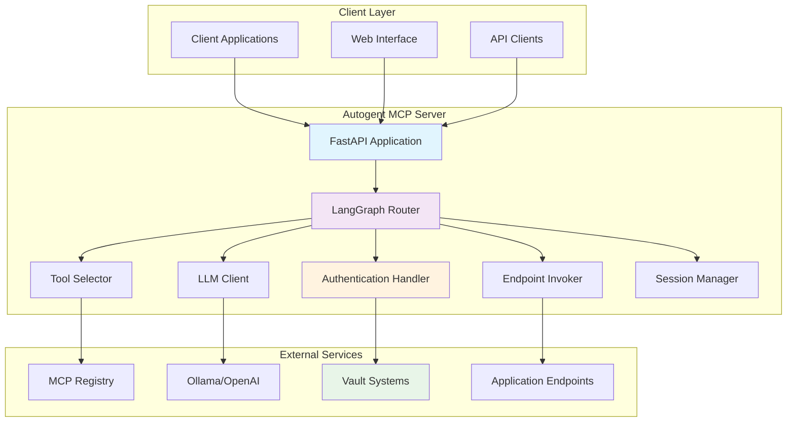
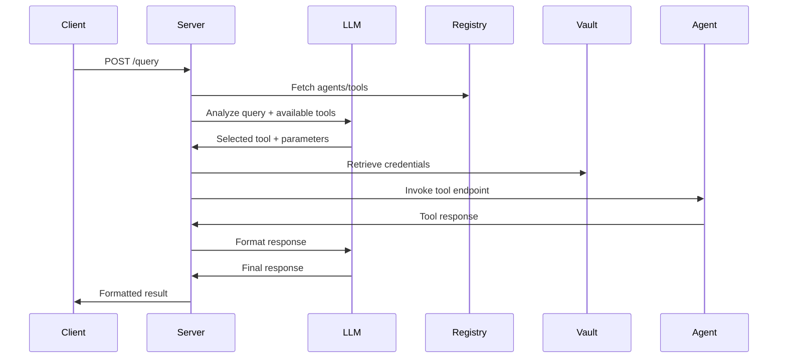

# Autogent MCP Server

A sophisticated FastAPI-based Model Context Protocol (MCP) server that provides intelligent query processing, dynamic agent/tool discovery, and comprehensive authentication with vault integration. Built with LLM-powered orchestration using LangGraph and Ollama.

## 🚀 Features

- **🤖 LLM-Powered Orchestration**: Uses Ollama/OpenAI for intelligent tool selection and query processing
- **🔍 Dynamic Agent Discovery**: Automatically fetches and updates agent/tool metadata from registry
- **🛡️ Comprehensive Authentication**: 11 authentication methods with vault integration
- **🔐 Multi-Vault Support**: HashiCorp Vault, Azure Key Vault, AWS Secrets Manager, GCP Secret Manager, Akeyless
- **💬 Session Management**: Maintains conversation context across multiple interactions
- **📊 Smart Caching**: Intelligent credential caching with TTL-based expiration
- **🔄 Auto-Sync**: Background registry synchronization every 5 minutes
- **📈 Production Ready**: Optimized for enterprise environments with monitoring and logging

## 🏗️ Architecture



## 🔧 Installation

### Prerequisites
- Python 3.9+
- Ollama server (for LLM processing)
- Access to MCP Registry Server
- Vault system (HashiCorp Vault, Azure Key Vault, etc.)

### Step 1: Clone and Setup

```bash
git clone https://github.com/autogentmcp/autogentmcp_server.git
cd autogentmcp_server

# Create virtual environment
python -m venv venv
source venv/bin/activate  # On Windows: venv\Scripts\activate

# Install dependencies
pip install -r requirements.txt
```

### Step 2: Configure Environment

```bash
# Copy environment template
cp .env.example .env

# Edit configuration
nano .env
```

**Core Configuration:**
```env
# Registry Configuration
REGISTRY_URL=http://localhost:8000/applications/with-endpoints
REGISTRY_ENVIRONMENT=production
REGISTRY_SYNC_INTERVAL=300

# LLM Configuration
OLLAMA_BASE_URL=http://localhost:11434
OLLAMA_MODEL=qwen2.5:14b
LLM_TEMPERATURE=0.1
LLM_MAX_TOKENS=2000

# Authentication
DEFAULT_API_KEY=your-default-api-key
DEFAULT_BEARER_TOKEN=your-default-token

# Vault Configuration (choose one)
VAULT_TYPE=hashicorp
VAULT_URL=https://vault.example.com:8200
VAULT_TOKEN=your-vault-token
VAULT_NAMESPACE=development
VAULT_PATH=autogentmcp
```

**Vault-Specific Configuration:**

=== "HashiCorp Vault"
    ```env
    VAULT_TYPE=hashicorp
    VAULT_URL=https://vault.example.com:8200
    VAULT_TOKEN=your-vault-token
    VAULT_NAMESPACE=development
    VAULT_PATH=autogentmcp
    VAULT_MOUNT=secret
    VAULT_VERIFY_SSL=true
    ```

=== "Azure Key Vault"
    ```env
    VAULT_TYPE=azure
    AZURE_KEYVAULT_URL=https://your-vault.vault.azure.net/
    AZURE_CLIENT_ID=your-client-id
    AZURE_CLIENT_SECRET=your-client-secret
    AZURE_TENANT_ID=your-tenant-id
    ```

=== "AWS Secrets Manager"
    ```env
    VAULT_TYPE=aws
    AWS_DEFAULT_REGION=us-east-1
    AWS_ACCESS_KEY_ID=your-access-key
    AWS_SECRET_ACCESS_KEY=your-secret-key
    ```

=== "GCP Secret Manager"
    ```env
    VAULT_TYPE=gcp
    GCP_PROJECT_ID=your-project-id
    GOOGLE_APPLICATION_CREDENTIALS=/path/to/service-account.json
    ```

=== "Akeyless"
    ```env
    VAULT_TYPE=akeyless
    AKEYLESS_URL=https://api.akeyless.io
    AKEYLESS_TOKEN=your-token
    # OR
    AKEYLESS_ACCESS_ID=your-access-id
    AKEYLESS_ACCESS_KEY=your-access-key
    ```

### Step 3: Setup Ollama

```bash
# Install Ollama
curl -fsSL https://ollama.ai/install.sh | sh

# Start Ollama service
ollama serve

# Pull the model
ollama pull qwen2.5:14b
```

### Step 4: Start the Server

```bash
# Start the server
uvicorn app.main:app --reload --host 0.0.0.0 --port 8001
```

## 📚 Core Concepts

### Query Processing Flow



### Session Management

The server maintains conversation context across multiple interactions:

```python
# Session data structure
{
    "session_id": "user-123",
    "conversation_history": [
        {"role": "user", "content": "Get user 123"},
        {"role": "assistant", "content": "Retrieved user data..."}
    ],
    "context": {
        "last_tool_used": "get_user",
        "last_agent": "user-service",
        "variables": {"current_user_id": 123}
    },
    "created_at": "2024-01-01T10:00:00Z",
    "updated_at": "2024-01-01T10:05:00Z"
}
```

## 🛡️ Authentication System

### Supported Authentication Methods

#### 1. API Key (`api_key`)
```python
# Vault storage
{
    "apiKey": "base64-encoded-key",
    "headerName": "X-API-Key",
    "format": "direct"
}

# Generated headers
{
    "X-API-Key": "decoded-api-key"
}
```

#### 2. Bearer Token (`bearer_token`)
```python
# Vault storage
{
    "token": "base64-encoded-token",
    "format": "bearer"
}

# Generated headers
{
    "Authorization": "Bearer decoded-token"
}
```

#### 3. Basic Authentication (`basic_auth`)
```python
# Vault storage
{
    "username": "base64-encoded-username",
    "password": "base64-encoded-password"
}

# Generated headers
{
    "Authorization": "Basic base64(username:password)"
}
```

#### 4. OAuth2 (`oauth2`)
```python
# Vault storage
{
    "access_token": "base64-encoded-token",
    "scope": "read write",
    "token_type": "bearer"
}

# Generated headers
{
    "Authorization": "Bearer access-token",
    "X-OAuth-Scope": "read write"
}
```

#### 5. JWT Token (`jwt`)
```python
# Vault storage
{
    "jwt_token": "base64-encoded-jwt",
    "algorithm": "HS256"
}

# Generated headers
{
    "Authorization": "Bearer jwt-token"
}
```

#### 6. Azure Subscription (`azure_subscription`)
```python
# Vault storage
{
    "subscription_key": "base64-encoded-key"
}

# Generated headers
{
    "Ocp-Apim-Subscription-Key": "subscription-key"
}
```

#### 7. Azure APIM (`azure_apim`)
```python
# Vault storage
{
    "apim_key": "base64-encoded-key"
}

# Generated headers
{
    "Ocp-Apim-Subscription-Key": "apim-key"
}
```

#### 8. AWS IAM (`aws_iam`)
```python
# Vault storage
{
    "access_key": "base64-encoded-key",
    "secret_key": "base64-encoded-secret",
    "region": "us-east-1"
}

# Generated headers (AWS SigV4)
{
    "Authorization": "AWS4-HMAC-SHA256 Credential=...",
    "X-Amz-Date": "20240101T120000Z"
}
```

#### 9. GCP Service Account (`gcp_service_account`)
```python
# Vault storage
{
    "service_account_key": "base64-encoded-json-key",
    "scope": "https://www.googleapis.com/auth/cloud-platform"
}

# Generated headers
{
    "Authorization": "Bearer access-token"
}
```

#### 10. Signature Authentication (`signature_auth`)
```python
# Vault storage
{
    "signature": "base64-encoded-signature",
    "timestamp": "auto-generated"
}

# Generated headers
{
    "X-Signature": "signature",
    "X-Timestamp": "timestamp"
}
```

#### 11. Custom Authentication (`custom`)
```python
# Vault storage
{
    "customHeaders": "base64-encoded-json",
    "template": "custom-template"
}

# Generated headers (from decoded customHeaders)
{
    "X-Custom-Header-1": "Custom Value 1",
    "X-Custom-Header-2": "Custom Value 2"
}
```

### Custom Headers Support

All authentication methods support additional custom headers:

```python
# Vault storage with custom headers
{
    "apiKey": "base64-encoded-key",
    "customHeaders": "base64-encoded-json"
}

# Decoded customHeaders (array format)
[
    {"name": "X-Custom-Header-1", "value": "Custom Value 1"},
    {"name": "X-Custom-Header-2", "value": "Custom Value 2"}
]

# Or object format
{
    "X-Custom-Header-1": "Custom Value 1",
    "X-Custom-Header-2": "Custom Value 2"
}
```

## 🔧 API Reference

### Query Processing

#### Process Query
```http
POST /query
Content-Type: application/json

{
    "query": "Get user with ID 123",
    "session_id": "user-session-1",
    "context": {
        "additional_context": "value"
    }
}
```

**Response:**
```json
{
    "response": "Here's the user information for ID 123: ...",
    "session_id": "user-session-1",
    "tool_used": "get_user",
    "agent_used": "user-service",
    "execution_time": 1.23,
    "metadata": {
        "confidence": 0.95,
        "tool_parameters": {"id": 123}
    }
}
```

### Session Management

#### List Sessions
```http
GET /sessions
```

#### Get Session Details
```http
GET /sessions/{session_id}
```

#### Clear Session
```http
DELETE /sessions/{session_id}
```

### Registry Management

#### Manual Registry Sync
```http
POST /sync_registry
```

#### Get Registry Status
```http
GET /registry/status
```

### Authentication Management

#### Generate Authentication Headers
```http
POST /auth/generate_headers_with_vault_key
Content-Type: application/json

{
    "vault_key": "env_cmd72flj7000jn5hwd4zv148p_security_settings",
    "authentication_method": "api_key"
}
```

#### Set Credential (Fallback)
```http
POST /auth/set_credential
Content-Type: application/json

{
    "key": "app_x29iirgfycp9e92iqkb04_api_key",
    "value": "your-api-key"
}
```

#### Get Registry Agents
```http
GET /auth/registry/agents
```

### Vault Management

#### Vault Statistics
```http
GET /vault/stats
```

#### Clear Vault Cache
```http
POST /vault/clear_cache
```

#### Test Credential Processing
```http
GET /vault/test_credential_processing
```

## 🎯 Usage Examples

### Basic Query Processing

```python
import requests

# Process a simple query
response = requests.post("http://localhost:8001/query", json={
    "query": "Get user information for ID 123",
    "session_id": "user-session-1"
})

result = response.json()
print(f"Response: {result['response']}")
print(f"Tool used: {result['tool_used']}")
print(f"Agent used: {result['agent_used']}")
```

### Session-Based Conversation

```python
import requests

session_id = "conversation-123"

# First query
response1 = requests.post("http://localhost:8001/query", json={
    "query": "Get user 123",
    "session_id": session_id
})

# Follow-up query with context
response2 = requests.post("http://localhost:8001/query", json={
    "query": "What is their email address?",
    "session_id": session_id
})

# The server maintains context between queries
```

### Multi-Step Workflow

```python
import requests

session_id = "workflow-456"

# Step 1: Get user information
response1 = requests.post("http://localhost:8001/query", json={
    "query": "Get user 123",
    "session_id": session_id
})

# Step 2: Update user based on previous result
response2 = requests.post("http://localhost:8001/query", json={
    "query": "Update that user's email to john.doe@example.com",
    "session_id": session_id
})

# Step 3: Get order history for the user
response3 = requests.post("http://localhost:8001/query", json={
    "query": "Get order history for this user",
    "session_id": session_id
})
```

## 🔄 Registry Integration

### Registry Data Structure

The server expects registry data in this format:

```json
{
    "name": "app_x29iirgfycp9e92iqkb04",
    "description": "Order Tracking Service",
    "appKey": "app_x29iirgfycp9e92iqkb04",
    "authenticationMethod": "api_key",
    "environment": {
        "baseDomain": "http://localhost:8081",
        "security": {
            "vaultKey": "env_cmd72flj7000jn5hwd4zv148p_security_settings"
        }
    },
    "endpoints": [
        {
            "name": "getOrderStatus",
            "path": "/orders/{orderId}/status",
            "method": "GET",
            "description": "Get order status by order ID",
            "pathParams": {"orderId": "String"},
            "queryParams": {"include": "String"}
        }
    ]
}
```

### Auto-Sync Configuration

```python
# Registry sync configuration
REGISTRY_SYNC_INTERVAL=300  # 5 minutes
REGISTRY_TIMEOUT=30        # 30 seconds
REGISTRY_MAX_RETRIES=3     # 3 retry attempts
```

## 🧠 LLM Integration

### Ollama Configuration

```python
# Ollama settings
OLLAMA_BASE_URL=http://localhost:11434
OLLAMA_MODEL=qwen2.5:14b
LLM_TEMPERATURE=0.1
LLM_MAX_TOKENS=2000
LLM_TIMEOUT=30
```

### OpenAI Configuration

```python
# OpenAI settings (alternative to Ollama)
OPENAI_API_KEY=your-openai-key
OPENAI_MODEL=gpt-4
OPENAI_TEMPERATURE=0.1
OPENAI_MAX_TOKENS=2000
```

### Custom LLM Prompts

```python
# Tool selection prompt
TOOL_SELECTION_PROMPT = """
You are an intelligent tool selector. Given a user query and available tools,
select the most appropriate tool and extract the necessary parameters.

Available tools:
{tools}

User query: {query}

Select the tool and provide parameters in JSON format.
"""

# Response formatting prompt
RESPONSE_FORMAT_PROMPT = """
Format the tool response in a user-friendly way.
Tool: {tool_name}
Response: {tool_response}

Provide a clear, helpful response to the user.
"""
```

## 🔒 Security Best Practices

### Vault Security

1. **Use Proper Authentication**: Always use vault-native authentication methods
2. **Rotate Credentials**: Implement regular credential rotation
3. **Environment Isolation**: Use different vault keys for different environments
4. **Access Control**: Implement proper access control in your vault system
5. **Audit Logging**: Enable audit logging for all vault operations

### Network Security

```python
# Use HTTPS in production
VAULT_URL=https://vault.example.com:8200
VAULT_VERIFY_SSL=true

# Enable CORS for specific origins
CORS_ORIGINS=["https://yourdomain.com"]
```

### API Security

```python
# Use API keys for authentication
API_KEY_HEADER=X-API-Key
API_KEY_VALIDATION=true

# Enable rate limiting
RATE_LIMIT_ENABLED=true
RATE_LIMIT_REQUESTS=100
RATE_LIMIT_PERIOD=60
```

## 📊 Monitoring and Observability

### Health Checks

```http
GET /health
```

**Response:**
```json
{
    "status": "healthy",
    "timestamp": "2024-01-01T12:00:00Z",
    "components": {
        "ollama": {"status": "healthy"},
        "registry": {"status": "healthy"},
        "vault": {"status": "healthy", "cached_secrets": 5}
    },
    "version": "1.0.0"
}
```

### Metrics Collection

```python
# Prometheus metrics
from prometheus_client import Counter, Histogram, Gauge

query_counter = Counter('queries_total', 'Total queries processed')
query_duration = Histogram('query_duration_seconds', 'Query processing time')
active_sessions = Gauge('active_sessions', 'Number of active sessions')
```

### Logging Configuration

```python
# Structured logging
import structlog

logger = structlog.get_logger()

# Log levels
LOG_LEVEL=INFO
LOG_FORMAT=json

# Request logging
REQUEST_LOGGING=true
RESPONSE_LOGGING=true
ERROR_LOGGING=true
```

## 🚀 Production Deployment

### Docker Deployment

```dockerfile
FROM python:3.11-slim

WORKDIR /app

# Install dependencies
COPY requirements.txt .
RUN pip install -r requirements.txt

# Copy application
COPY . .

# Expose port
EXPOSE 8001

# Health check
HEALTHCHECK --interval=30s --timeout=10s --start-period=5s --retries=3 \
    CMD curl -f http://localhost:8001/health || exit 1

# Start application
CMD ["uvicorn", "app.main:app", "--host", "0.0.0.0", "--port", "8001"]
```

### Kubernetes Deployment

```yaml
apiVersion: apps/v1
kind: Deployment
metadata:
  name: autogent-mcp-server
spec:
  replicas: 3
  selector:
    matchLabels:
      app: autogent-mcp-server
  template:
    metadata:
      labels:
        app: autogent-mcp-server
    spec:
      containers:
      - name: app
        image: autogent-mcp-server:latest
        ports:
        - containerPort: 8001
        env:
        - name: VAULT_URL
          valueFrom:
            secretKeyRef:
              name: vault-config
              key: url
        - name: VAULT_TOKEN
          valueFrom:
            secretKeyRef:
              name: vault-config
              key: token
        livenessProbe:
          httpGet:
            path: /health
            port: 8001
          initialDelaySeconds: 30
          periodSeconds: 10
        readinessProbe:
          httpGet:
            path: /health
            port: 8001
          initialDelaySeconds: 5
          periodSeconds: 5
```

### Environment-Specific Configuration

```python
# Production environment
ENVIRONMENT=production
DEBUG=false
LOG_LEVEL=INFO

# Performance settings
WORKERS=4
MAX_CONNECTIONS=100
POOL_SIZE=20

# Security settings
VAULT_VERIFY_SSL=true
CORS_ORIGINS=["https://yourdomain.com"]
ALLOWED_HOSTS=["yourdomain.com"]
```

## 🔍 Troubleshooting

### Common Issues

#### Registry Connection Issues
```python
# Check registry connectivity
import requests

try:
    response = requests.get("http://localhost:8000/health", timeout=10)
    print(f"Registry status: {response.status_code}")
except requests.exceptions.RequestException as e:
    print(f"Registry connection error: {e}")
```

#### Vault Authentication Issues
```python
# Test vault connectivity
import hvac

client = hvac.Client(url="http://localhost:8200")
client.token = "your-token"

try:
    health = client.sys.read_health_status()
    print(f"Vault health: {health}")
except Exception as e:
    print(f"Vault error: {e}")
```

#### LLM Processing Issues
```python
# Test Ollama connectivity
import requests

try:
    response = requests.get("http://localhost:11434/api/tags")
    models = response.json()
    print(f"Available models: {models}")
except Exception as e:
    print(f"Ollama error: {e}")
```

### Debug Mode

Enable debug logging:

```python
# Environment variables
DEBUG=true
LOG_LEVEL=DEBUG

# Specific loggers
LOGGER_LEVEL_AUTH=DEBUG
LOGGER_LEVEL_VAULT=DEBUG
LOGGER_LEVEL_LLM=DEBUG
```

### Performance Troubleshooting

```python
# Monitor query performance
import time

start_time = time.time()
# Process query
end_time = time.time()

execution_time = end_time - start_time
if execution_time > 5.0:
    logger.warning(f"Slow query detected: {execution_time}s")
```

## 🤝 Contributing

1. Fork the repository
2. Create a feature branch: `git checkout -b feature/amazing-feature`
3. Make your changes
4. Add tests for new functionality
5. Ensure all tests pass: `pytest`
6. Submit a pull request

## 📄 License

This project is licensed under the MIT License - see the [LICENSE](https://github.com/autogentmcp/autogentmcp_server/blob/main/LICENSE) file for details.

**Note**: LICENSE file will be added to the repository soon. See the [Contributing Guide](contributing.md#license) for full license details.

---

**Next Steps**: 
- Set up the [MCP Registry Server](mcp-registry.md) as a prerequisite
- Check out the [MCP Core Java SDK](mcp-core-java.md) for easy integration
- Explore the [Demo Applications](mcp-demo-apps.md) for real-world examples
