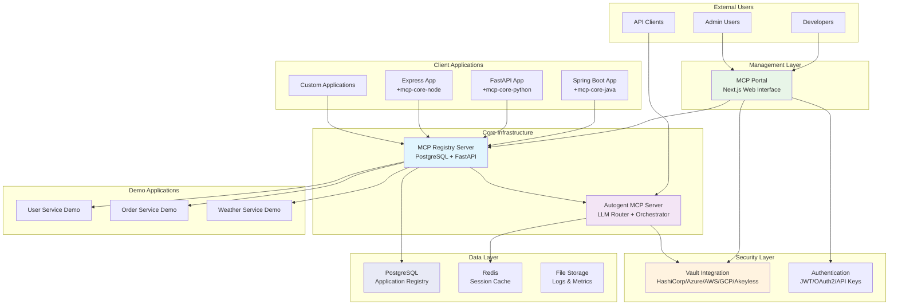
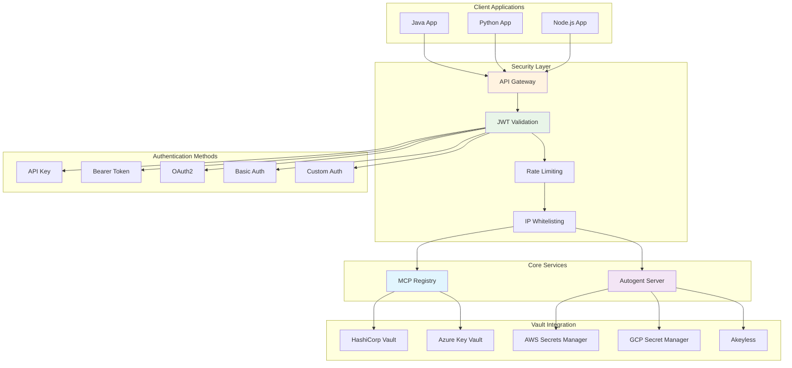
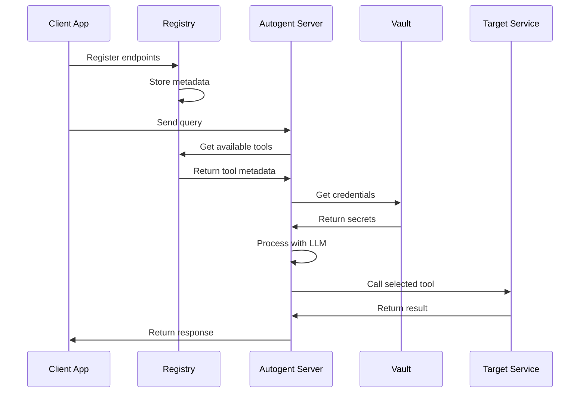
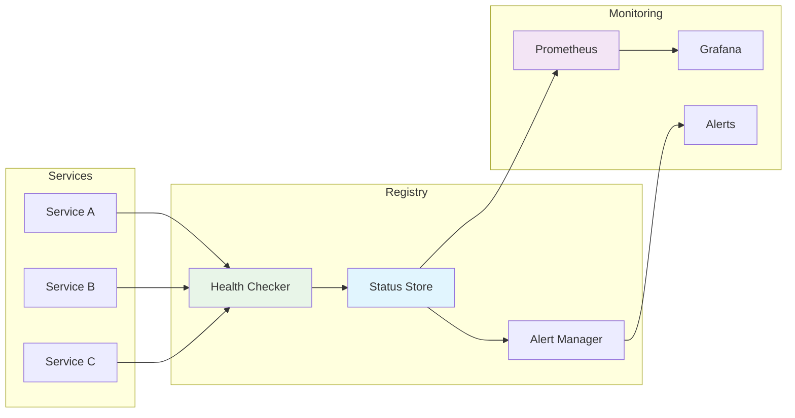
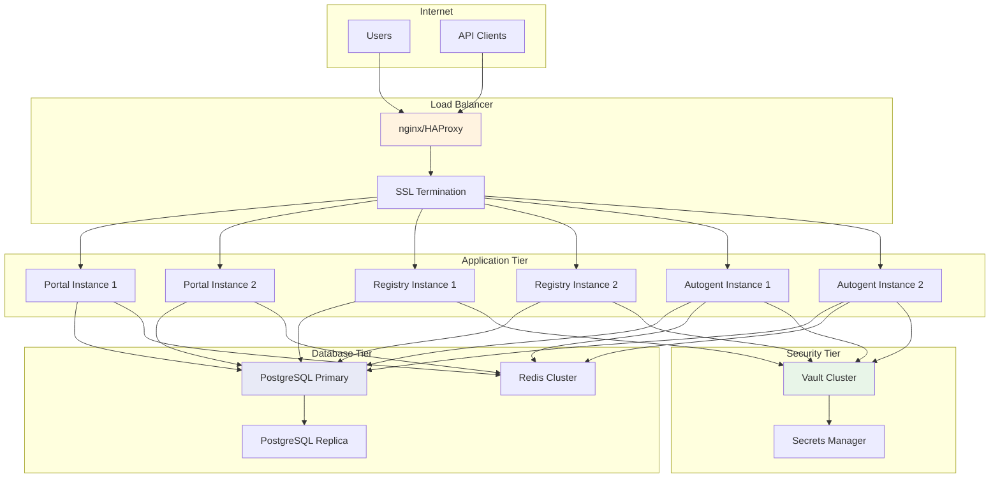
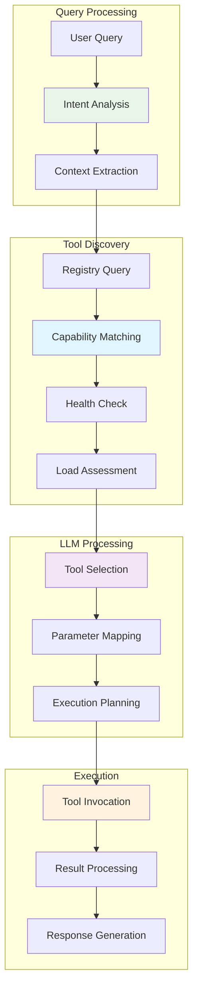
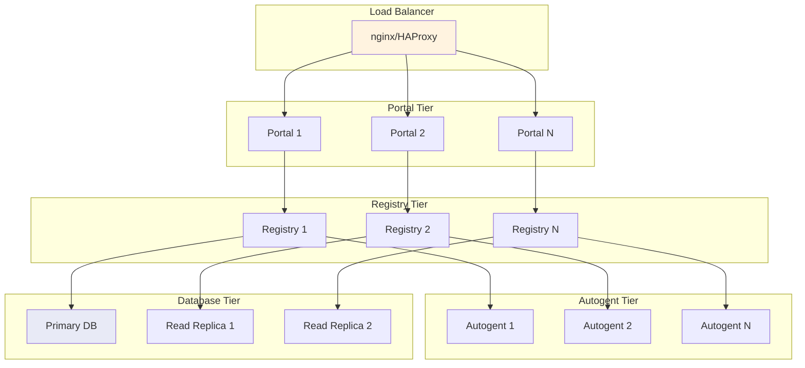
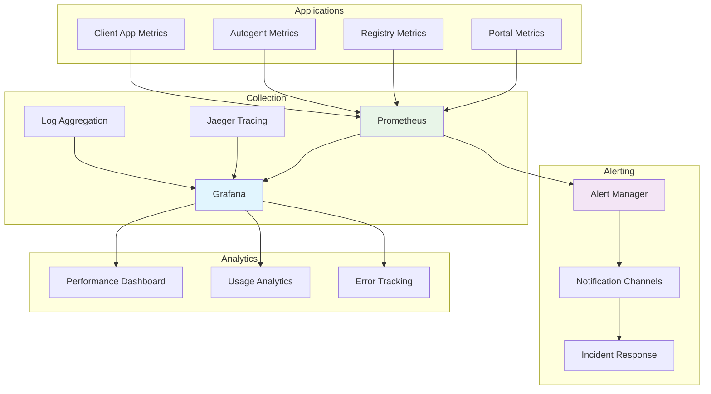
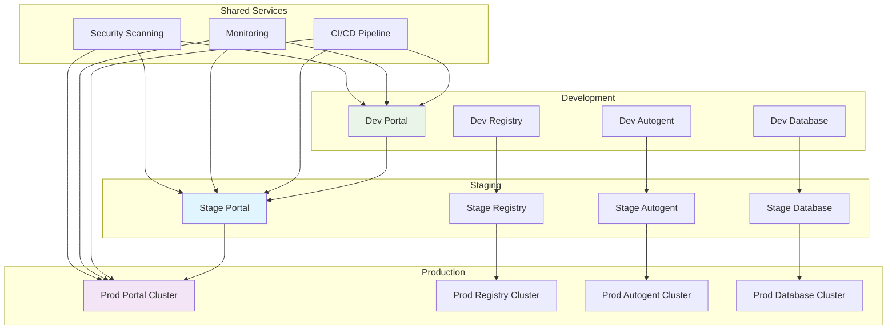

# Ecosystem Architecture Diagrams

This page provides comprehensive architectural diagrams and visual representations of the Autogent MCP ecosystem.

## 🏗️ High-Level Architecture

### Complete Ecosystem Overview



## 🔄 Application Lifecycle

### From Portal to Production

```mermaid
graph LR
    subgraph "1. Portal Management"
        A[Create Application]
        B[Configure Environment]
        C[Generate API Keys]
        D[Set Security Policies]
    end
    
    subgraph "2. Development"
        E[Integrate SDK]
        F[Register Endpoints]
        G[Test Locally]
    end
    
    subgraph "3. Registry"
        H[Auto-Register]
        I[Health Checks]
        J[Endpoint Discovery]
    end
    
    subgraph "4. Production"
        K[Load Balancing]
        L[Monitoring]
        M[Scaling]
    end
    
    A --> B --> C --> D
    D --> E --> F --> G
    G --> H --> I --> J
    J --> K --> L --> M
    
    style A fill:#e8f5e8
    style E fill:#e1f5fe
    style H fill:#f3e5f5
    style K fill:#fff3e0
```



## 🔐 Security Architecture

### Authentication & Authorization Flow



## 📊 Data Flow Diagrams

### Request Processing Flow



### Health Monitoring Flow



## 🌐 Network Architecture

### Production Deployment



## 🔧 Component Interactions

### SDK Integration Patterns

```mermaid
graph TB
    subgraph "Java SDK"
        A[Spring Boot Auto-Config]
        B[@EnableAutogentMcp]
        C[@AutogentTool]
        D[Endpoint Registration]
    end
    
    subgraph "Python SDK (Future)"
        E[FastAPI Integration]
        F[Flask Integration]
        G[Decorator Pattern]
        H[Async Support]
    end
    
    subgraph "Node.js SDK (Future)"
        I[Express Middleware]
        J[TypeScript Support]
        K[Route Discovery]
        L[OpenAPI Generation]
    end
    
    subgraph "Registry Server"
        M[Application Manager]
        N[Endpoint Store]
        O[Health Monitor]
    end
    
    A --> D
    B --> D
    C --> D
    D --> M
    
    E --> G
    F --> G
    G --> H
    H --> M
    
    I --> K
    J --> K
    K --> L
    L --> M
    
    M --> N
    N --> O
    
    style A fill:#e8f5e8
    style E fill:#e1f5fe
    style I fill:#f3e5f5
    style M fill:#fff3e0
```

## 🎯 Service Discovery

### Intelligent Tool Selection



## 📈 Scaling Patterns

### Horizontal Scaling



## 🔍 Monitoring & Observability

### Metrics Collection



## 🚀 Deployment Patterns

### Multi-Environment Setup



---

## 📚 Understanding the Diagrams

### Legend

- **Green nodes**: Management and UI components
- **Blue nodes**: Core infrastructure services
- **Purple nodes**: Orchestration and intelligence
- **Orange nodes**: Security and authentication
- **Light blue nodes**: Data storage and caching

### Best Practices

1. **Start with the Portal** for application management
2. **Use the Registry** for service discovery
3. **Leverage the Autogent Server** for intelligent orchestration
4. **Implement proper security** with vault integration
5. **Monitor everything** with comprehensive observability

### Next Steps

- **Portal Setup**: Begin with [MCP Portal](portal.md)
- **Registry Configuration**: Continue with [MCP Registry](mcp-registry.md)
- **SDK Integration**: Choose your [SDK](mcp-core-java.md)
- **Production Deployment**: Follow the [Deployment Guide](deployment.md)

---

*These diagrams represent the current and planned architecture of the Autogent MCP ecosystem. For implementation details, refer to the specific component documentation.*
