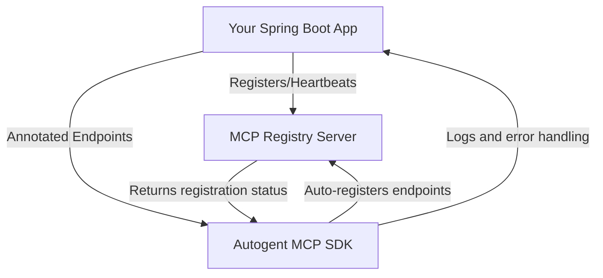

# MCP Core Java SDK Documentation Site

Welcome to the documentation site for the MCP Core Java SDK!

## Overview
This site provides:
- Project introduction and features
- Installation and usage instructions
- API documentation
- Integration and ecosystem diagrams
- Contribution guidelines

---

## MCP Ecosystem Overview

The Model Context Protocol (MCP) ecosystem is composed of several open-source repositories that work together to enable agent/tool registration, discovery, and orchestration across multiple languages and platforms.

### Key Repositories
- [mcp-core-java](https://github.com/autogentmcp/core-java): Java SDK for MCP registry integration (Spring Boot, annotation-driven).
- [mcp-core-python](https://github.com/autogentmcp/core-python): Python SDK for MCP registry integration (FastAPI, decorator-driven).
- [mcp-core-node](https://github.com/autogentmcp/core-node): Node.js SDK for MCP registry integration (Express, decorator-driven).
- [mcp-registry-server](https://github.com/autogentmcp/registry-server): Central registry server for agent/tool registration and discovery.
- [mcp-demo-apps](https://github.com/autogentmcp/demo-apps): Example applications demonstrating SDK usage and integration.


---

## Project Diagram



---

## Ecosystem Diagram

```mermaid
graph TD
    subgraph Apps & SDKs
        A1[Spring Boot App\n(mcp-core-java)]
        A2[FastAPI App\n(mcp-core-python)]
        A3[Express App\n(mcp-core-node)]
    end
    B[MCP Registry Server]
    A1 -- Registers/Heartbeats --> B
    A2 -- Registers/Heartbeats --> B
    A3 -- Registers/Heartbeats --> B
    B -- Discovery/Status --> A1
    B -- Discovery/Status --> A2
    B -- Discovery/Status --> A3
```

---

## How It Connects

- Each SDK (Java, Python, Node) provides annotation/decorator-based registration for your endpoints.
- On startup, your app registers its endpoints and health status with the MCP Registry Server.
- The registry enables discovery, orchestration, and monitoring of all registered agents/tools across the ecosystem.
- Demo apps show best practices and advanced integration patterns.

---

## Java Quick Start Example

Add the following dependency to your `pom.xml`:

```xml
<dependency>
  <groupId>com.autogentmcp</groupId>
  <artifactId>mcp-core-java</artifactId>
  <version>0.0.1</version> <!-- Use the latest released version -->
</dependency>
```

Annotate your Spring Boot application and endpoints:

```java
import com.autogentmcp.registry.EnableAutogentMcp;
import com.autogentmcp.registry.AutogentTool;
import org.springframework.boot.SpringApplication;
import org.springframework.boot.autoconfigure.SpringBootApplication;
import org.springframework.web.bind.annotation.*;

@EnableAutogentMcp(key = "my-app-key", description = "Demo Spring Boot App")
@SpringBootApplication
public class MyApplication {
    public static void main(String[] args) {
        SpringApplication.run(MyApplication.class, args);
    }
}

@RestController
class MyController {
    @AutogentTool(
        uri = "/hello",
        description = "Returns a greeting",
        method = "GET"
    )
    @GetMapping("/hello")
    public String hello() {
        return "Hello from MCP!";
    }
}
```

On startup, your endpoints will be automatically registered with the MCP Registry Server.

---

## Get Started
- See the [Installation](installation.md) and [Usage](usage.md) sections for details.

## Contributing
- See [CONTRIBUTING.md](CONTRIBUTING.md) for guidelines.

---

*This site is built with MkDocs. To run locally:*

```sh
pip install mkdocs mkdocs-material
mkdocs serve
```

---

For more, visit the [GitHub repository](https://github.com/autogentmcp/core-java).
