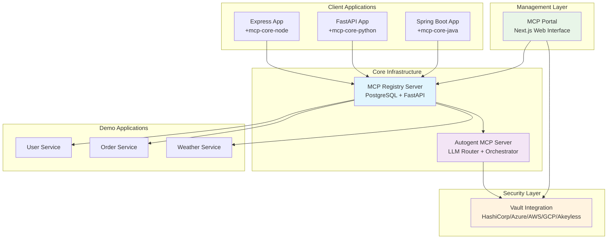

# Autogent MCP Ecosystem Documentation

Welcome to the comprehensive documentation site for the Autogent Model Context Protocol (MCP) ecosystem!

## 🚀 Overview

The Autogent MCP ecosystem is a complete, enterprise-ready solution for building intelligent agent networks with automatic service discovery, registration, and orchestration. Our ecosystem enables seamless integration between AI agents, tools, and services across multiple programming languages and platforms.

### 🎯 What Makes Our Ecosystem Special

- **🔄 Automatic Registration**: Services automatically register themselves with the central registry
- **🔍 Intelligent Discovery**: AI-powered service discovery and selection
- **🛡️ Enterprise Security**: Comprehensive authentication with vault integration
- **📊 Health Monitoring**: Real-time health checks and status tracking
- **🌐 Multi-Language Support**: SDKs for Java, Python, and Node.js
- **⚡ High Performance**: Optimized for production workloads with caching and connection pooling

---

## 🏗️ Architecture Overview



---

## 🔧 Core Components

### �️ [MCP Portal](portal.md)
**The management interface** - Professional Next.js web application for managing the entire MCP ecosystem.

- **Application Management**: Create, configure, and manage MCP applications
- **Environment Configuration**: Multi-environment support (dev/staging/prod)
- **API Key Generation**: Secure key management with expiration
- **Security Provider Integration**: Support for 5 major enterprise security providers
- **Professional UI**: Modern, responsive interface with dark mode support

### �🎯 [MCP Registry Server](mcp-registry.md)
**The heart of the ecosystem** - A high-performance PostgreSQL-backed registry for managing applications, environments, and endpoints.

- **FastAPI + PostgreSQL**: Enterprise-grade performance and reliability
- **Multi-Environment Support**: Development, staging, production isolation
- **Health Monitoring**: Automatic health checks with configurable thresholds
- **API Key Management**: Secure authentication with bcrypt hashing
- **Comprehensive APIs**: RESTful endpoints for all operations

### 🤖 [Autogent MCP Server](autogentmcp_server.md)
**The intelligent orchestrator** - LLM-powered query processing and service orchestration with comprehensive authentication.

- **LLM Integration**: Uses Ollama/OpenAI for intelligent tool selection
- **11 Auth Methods**: API Key, Bearer, OAuth2, JWT, Azure, AWS, GCP, and more
- **Vault Integration**: Secure credential management across 5 vault providers
- **Session Management**: Conversation context and state management
- **Smart Caching**: Optimized credential retrieval with TTL-based caching

### 📚 SDKs and Libraries

#### ☕ [MCP Core Java SDK](mcp-core-java.md)
**Spring Boot integration made simple** - Annotation-driven endpoint registration with auto-configuration.

- **Java 8+ Compatible**: Works with Java 8 through Java 21
- **Spring Boot 2.x/3.x**: Seamless integration with existing applications
- **Annotation-Driven**: `@EnableAutogentMcp` and `@AutogentTool` annotations
- **Auto-Discovery**: Automatic HTTP method and parameter detection
- **Batch Registration**: Efficient endpoint registration in single requests

#### 🐍 [MCP Core Python SDK](mcp-core-python.md)
**FastAPI and Flask integration** - Decorator-based endpoint registration with automatic schema generation.

- **Framework Agnostic**: Works with FastAPI, Flask, Django, and more
- **Type Hints**: Full support for Python type annotations
- **Async Support**: Built for modern async Python applications
- **Automatic Validation**: Request/response validation with Pydantic

#### 🟢 [MCP Core Node SDK](mcp-core-node.md)
**Express.js and beyond** - Middleware-based integration with TypeScript support.

- **TypeScript First**: Full TypeScript support with type safety
- **Express.js Integration**: Seamless middleware integration
- **Automatic Discovery**: Route introspection and metadata generation
- **OpenAPI Generation**: Automatic API documentation generation

---

## 🎮 Demo Applications

### 🧪 [MCP Demo Apps](mcp-demo-apps.md)
**Learn by example** - Complete demo applications showcasing best practices and integration patterns.

- **Multi-Service Architecture**: User, Order, and Weather services
- **Real-World Examples**: Production-ready code patterns
- **End-to-End Integration**: Full ecosystem integration demonstrations
- **Testing Examples**: Unit and integration test examples

---

## 🚀 Quick Start

### 1. Set Up the Portal (Management Interface)

```bash
# Clone and setup the portal
git clone https://github.com/autogentmcp/portal.git
cd portal
npm install

# Configure environment
cp .env.example .env
# Edit .env with your security provider settings

# Setup database
npx prisma migrate dev

# Start the portal
npm run dev
```

Visit `http://localhost:3000` to access the Portal interface.

### 2. Set Up the Registry Server

```bash
# Clone and setup the registry
git clone https://github.com/autogentmcp/mcp-registry.git
cd mcp-registry
pip install -r requirements.txt
prisma generate && prisma db push

# Start the registry
python run_server.py
```

### 3. Create Your First Application

**Step 1: Use the Portal to create an application**
1. Open the Portal at `http://localhost:3000`
2. Create a new application with your desired configuration
3. Generate API keys for your application
4. Configure security settings and secrets

**Step 2: Integrate with your application**

=== "Java (Spring Boot)"

    ```xml
    <!-- Add to your pom.xml -->
    <dependency>
        <groupId>com.autogentmcp</groupId>
        <artifactId>mcp-core-java</artifactId>
        <version>0.0.2</version>
    </dependency>
    ```

    ```java
    @EnableAutogentMcp(key = "my-app", description = "My First MCP App")
    @SpringBootApplication
    public class MyApplication {
        public static void main(String[] args) {
            SpringApplication.run(MyApplication.class, args);
        }
    }

    @RestController
    class MyController {
        @AutogentTool(
            uri = "/hello/{name}",
            description = "Greets a user by name",
            method = "GET"
        )
        @GetMapping("/hello/{name}")
        public String hello(@PathVariable String name) {
            return "Hello, " + name + "!";
        }
    }
    ```

=== "Python (FastAPI)"

    ```python
    # Coming soon - Python SDK
    from mcp_core_python import MCPApp, tool

    app = MCPApp(
        key="my-app",
        description="My First MCP App",
        registry_url="http://localhost:8000"
    )

    @app.tool("/hello/{name}", method="GET")
    def hello(name: str):
        return f"Hello, {name}!"
    ```

=== "Node.js (Express)"

    ```javascript
    // Coming soon - Node.js SDK
    const { MCPApp, tool } = require('mcp-core-node');

    const app = new MCPApp({
        key: 'my-app',
        description: 'My First MCP App',
        registryUrl: 'http://localhost:8000'
    });

    app.tool('/hello/:name', 'GET', (req, res) => {
        res.json({ message: `Hello, ${req.params.name}!` });
    });
    ```

### 4. Start the Orchestrator

```bash
# Clone and setup the orchestrator
git clone https://github.com/autogentmcp/autogentmcp_server.git
cd autogentmcp_server
pip install -r requirements.txt

# Start the orchestrator
uvicorn app.main:app --reload --port 8001
```

### 5. Test Your Setup

```bash
# Test the ecosystem
curl -X POST "http://localhost:8001/query" \
  -H "Content-Type: application/json" \
  -d '{"query": "Say hello to Alice", "session_id": "test-session"}'
```

---

## 🔐 Security & Authentication

Our ecosystem provides enterprise-grade security with comprehensive authentication support:

### Supported Authentication Methods
- **API Key**: Header-based and query parameter authentication
- **Bearer Token**: JWT and OAuth2 token authentication
- **Basic Auth**: Username/password authentication
- **OAuth2**: Full OAuth2 flow support with token refresh
- **Azure**: Azure Subscription and APIM authentication
- **AWS**: IAM and SigV4 signature authentication
- **GCP**: Service account authentication
- **Custom**: Flexible custom authentication schemes

### Vault Integration
Secure credential management with support for:
- **HashiCorp Vault**: Enterprise secret management
- **Azure Key Vault**: Azure-native secret storage
- **AWS Secrets Manager**: AWS-native secret management
- **GCP Secret Manager**: Google Cloud secret management
- **Akeyless**: Cloud-native security platform

---

## 📊 Production Features

### Health Monitoring
- Automatic health checks for all registered services
- Configurable failure thresholds and retry logic
- Environment-specific health monitoring
- Historical health data and analytics

### Performance Optimization
- Intelligent caching with TTL-based expiration
- Connection pooling for external services
- Batch endpoint registration
- Startup preloading for faster responses

### Observability
- Comprehensive logging with structured output
- Audit trails for all registry operations
- Session tracking and conversation context
- Performance metrics and monitoring

---

## 🌟 Getting Started

Choose your path to get started with the Autogent MCP ecosystem:

<div class="grid cards" markdown>

- **🎛️ First Time Setup?** Start with the [MCP Portal](portal.md) to create applications and manage security
- **🔰 New to MCP?** Continue with our [Architecture Overview](diagrams.md) to understand the ecosystem
- **☕ Java Developer?** Jump into the [Java SDK Guide](mcp-core-java.md) for Spring Boot integration
- **🐍 Python Developer?** Explore the [Python SDK Guide](mcp-core-python.md) for FastAPI/Flask integration
- **🟢 Node.js Developer?** Check out the [Node.js SDK Guide](mcp-core-node.md) for Express.js integration
- **🎮 Want Examples?** Browse our [Demo Applications](mcp-demo-apps.md) for real-world examples
- **🚀 Ready to Deploy?** Follow our [Production Deployment Guide](deployment.md) for enterprise setup

</div>

---

## 🤝 Community & Support

- **📝 Documentation**: Comprehensive guides and API references
- **🐛 Issue Tracking**: GitHub Issues for bug reports and feature requests
- **💬 Discussions**: Community discussions and Q&A
- **🔄 Updates**: Regular updates and new feature releases

---

## 🚀 Contributing to the Ecosystem

We welcome contributions to the Autogent MCP ecosystem! Whether you're fixing bugs, adding features, improving documentation, or creating new integrations, your contributions help make the ecosystem better for everyone.

### 🎯 Ways to Contribute

#### 🔧 Code Contributions
- **Core Components**: Improve the Portal, Registry Server, or Autogent Server
- **SDK Development**: Help build the Python and Node.js SDKs
- **New Features**: Add authentication methods, vault providers, or monitoring tools
- **Performance**: Optimize caching, connection pooling, or query processing
- **Testing**: Add unit tests, integration tests, or end-to-end tests

#### 📚 Documentation
- **Guides & Tutorials**: Write getting started guides or advanced tutorials
- **API Documentation**: Improve API reference documentation
- **Examples**: Create demo applications or integration examples
- **Architecture**: Help document system architecture and design decisions

#### 🛠️ Tools & Integrations
- **Framework Integrations**: Add support for new web frameworks
- **Security Providers**: Integrate new vault or secret management providers
- **Monitoring Tools**: Add support for new monitoring and observability tools
- **CI/CD**: Improve build, test, and deployment pipelines

### 🏁 Getting Started

#### 1. Choose Your Repository

| Repository | Description | Technologies |
|------------|-------------|--------------|
| [Portal](https://github.com/autogentmcp/portal) | Management interface | Next.js, TypeScript, Prisma |
| [Registry](https://github.com/autogentmcp/mcp-registry) | Core registry server | FastAPI, PostgreSQL, Python |
| [Autogent Server](https://github.com/autogentmcp/autogentmcp_server) | LLM orchestrator | FastAPI, Python, LLM APIs |
| [Java SDK](https://github.com/autogentmcp/mcp-core-java) | Spring Boot integration | Java, Spring Boot, Maven |
| [Python SDK](https://github.com/autogentmcp/mcp-core-python) | Python frameworks | Python, FastAPI, Flask |
| [Node.js SDK](https://github.com/autogentmcp/mcp-core-node) | Node.js frameworks | TypeScript, Express, Fastify |
| [Demo Apps](https://github.com/autogentmcp/mcp-demo-apps) | Example applications | Multiple languages |

#### 2. Set Up Your Development Environment

```bash
# Fork the repository on GitHub
# Clone your fork
git clone https://github.com/YOUR_USERNAME/REPOSITORY_NAME.git
cd REPOSITORY_NAME

# Add upstream remote
git remote add upstream https://github.com/autogentmcp/REPOSITORY_NAME.git

# Create a feature branch
git checkout -b feature/your-feature-name
```

#### 3. Development Guidelines

**Code Style**:
- Follow the existing code style in each repository
- Use appropriate linting tools (ESLint, Flake8, Checkstyle)
- Write clear, self-documenting code with comments where needed

**Testing**:
- Add unit tests for new features
- Ensure all tests pass before submitting
- Include integration tests for complex features

**Documentation**:
- Update relevant documentation for new features
- Add docstrings/comments for public APIs
- Include examples in your documentation

### 📋 Contribution Process

#### 1. Before You Start
- Check existing issues and pull requests
- Discuss large changes in GitHub Discussions
- Review the project roadmap and priorities

#### 2. Making Changes
```bash
# Keep your fork updated
git fetch upstream
git checkout main
git merge upstream/main

# Create feature branch
git checkout -b feature/your-feature

# Make your changes
# Add tests
# Update documentation

# Commit with clear messages
git commit -m "feat: add new authentication method for XYZ"
```

#### 3. Submitting Changes
```bash
# Push to your fork
git push origin feature/your-feature

# Create pull request on GitHub
# Fill out the PR template
# Respond to code review feedback
```

### 🏷️ Issue Guidelines

#### 🐛 Bug Reports
```markdown
**Bug Description**: Clear description of the issue
**Steps to Reproduce**: Step-by-step instructions
**Expected Behavior**: What should happen
**Actual Behavior**: What actually happens
**Environment**: OS, versions, configuration
**Logs**: Relevant error messages or logs
```

#### ✨ Feature Requests
```markdown
**Feature Description**: Clear description of the proposed feature
**Use Case**: Why this feature would be useful
**Proposed Solution**: How you think it should work
**Alternatives**: Other approaches you've considered
**Additional Context**: Any other relevant information
```

### 🎖️ Recognition

Contributors are recognized in several ways:
- **Contributors Section**: Listed in repository README files
- **Release Notes**: Credited in release announcements
- **Community Spotlight**: Featured in community discussions
- **Maintainer Status**: Active contributors may become maintainers

### 🔄 Development Workflow

#### For Core Components (Portal, Registry, Autogent Server)
1. **Local Development**: Set up local environment with all dependencies
2. **Feature Development**: Create feature branch and implement changes
3. **Testing**: Run full test suite including integration tests
4. **Documentation**: Update relevant documentation
5. **Pull Request**: Submit PR with clear description and tests

#### For SDKs (Java, Python, Node.js)
1. **SDK Setup**: Set up development environment for target language
2. **API Design**: Follow established patterns and conventions
3. **Implementation**: Write clean, well-documented code
4. **Testing**: Add comprehensive unit and integration tests
5. **Examples**: Create working examples demonstrating usage

#### For Documentation
1. **Content Creation**: Write clear, comprehensive documentation
2. **Review Process**: Have technical accuracy reviewed
3. **Testing**: Ensure all code examples work correctly
4. **Integration**: Integrate with existing documentation structure

### 🛡️ Security Contributions

Security is critical for the MCP ecosystem. If you discover security vulnerabilities:

1. **DO NOT** create public issues for security vulnerabilities
2. **Email**: Send details to security@autogentmcp.org
3. **Include**: Detailed description, reproduction steps, and potential impact
4. **Response**: We'll acknowledge within 48 hours and provide updates

### 🌟 Special Contributing Opportunities

#### 🚀 Python SDK Development
**Status**: Active development needed
**Skills**: Python, FastAPI, Flask, Django, async programming
**Impact**: Enable Python developers to use the MCP ecosystem

#### 🟢 Node.js SDK Development  
**Status**: Active development needed
**Skills**: TypeScript, Express, Fastify, Koa, middleware development
**Impact**: Enable Node.js developers to use the MCP ecosystem

#### 🔐 Security Provider Integrations
**Status**: Ongoing expansion
**Skills**: Security protocols, API integration, credential management
**Impact**: Add support for more enterprise security providers

#### 📊 Monitoring & Observability
**Status**: Enhancement needed
**Skills**: Prometheus, Grafana, distributed tracing, metrics
**Impact**: Improve production monitoring capabilities

### 💡 Community Guidelines

- **Be Respectful**: Treat all community members with respect
- **Be Inclusive**: Welcome contributors from all backgrounds
- **Be Constructive**: Provide helpful feedback and suggestions
- **Be Patient**: Remember that everyone is learning
- **Be Collaborative**: Work together to solve problems

### 📞 Getting Help

- **GitHub Discussions**: For general questions and discussions
- **Discord**: Real-time chat with the community (link in repositories)
- **Office Hours**: Regular community calls (schedule in discussions)
- **Mentorship**: Pair with experienced contributors for guidance

---

## 📈 Ecosystem Statistics

- **🔧 11 Authentication Methods**: Comprehensive security coverage
- **🌍 5 Vault Providers**: Multi-cloud secret management
- **📚 3 Language SDKs**: Java, Python, Node.js support
- **⚡ Production Ready**: Ready to use in enterprise environments

---

*This documentation is built with MkDocs Material. To run locally:*

```bash
pip install mkdocs mkdocs-material
mkdocs serve
```

---

## 📄 License

The Autogent MCP ecosystem is released under the **MIT License**. This allows for maximum flexibility and adoption while maintaining attribution requirements.

**Key Benefits:**
- ✅ **Commercial Use**: Use in commercial applications
- ✅ **Modification**: Modify source code freely
- ✅ **Distribution**: Distribute and sublicense
- ✅ **Enterprise Friendly**: No copyleft restrictions

See the [Contributing Guide](contributing.md#license) for full license details.

---

**🌟 Star us on GitHub**: [autogentmcp organization](https://github.com/autogentmcp)
